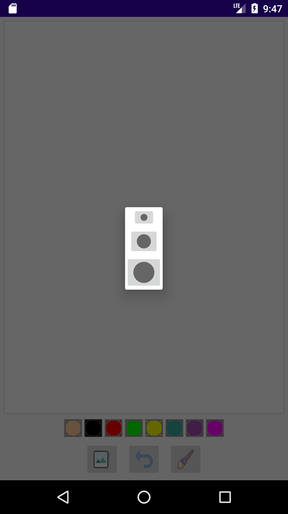
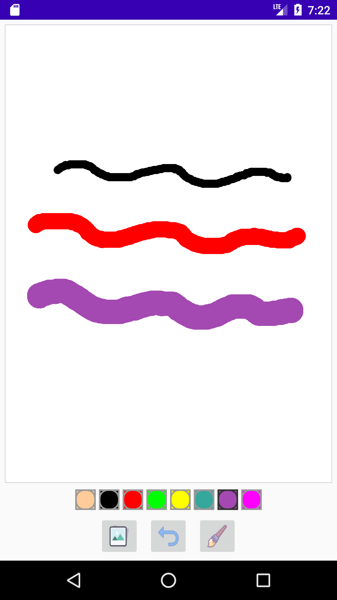
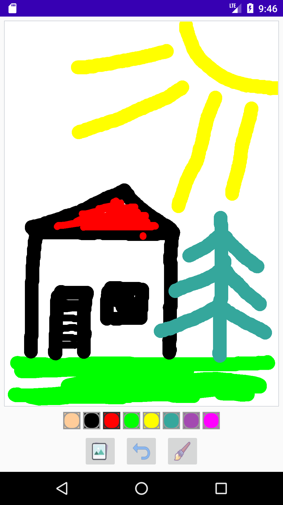

# Kids Drawing-App

Code-along project from the Udemy-course [The Complete Android 10 & Kotlin Development Masterclass](https://www.udemy.com/course/android-kotlin-developer/) by Denis Panjuta.

  &nbsp;&nbsp; 
  &nbsp;&nbsp;
  %nbps;&nbsp;
  

